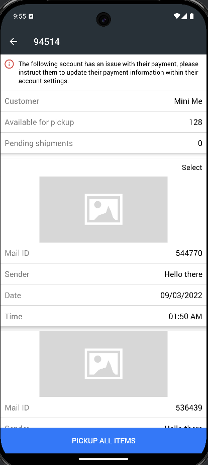
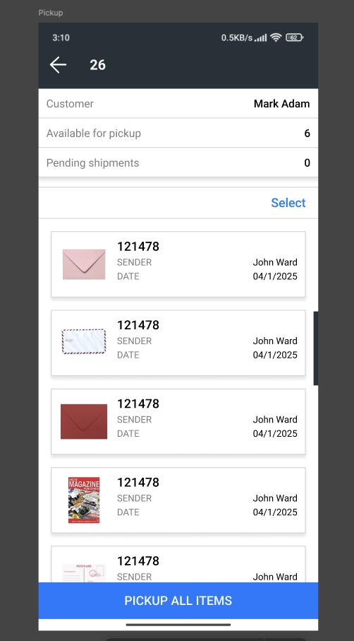

---

### 📌 **Tech Documentation - Android UI Update**

## 📝 **Project Overview**

This document provides an overview of the UI updates made to the Android application. The update includes structural improvements, better UI components, and an enhanced user experience.

---

## 🔄 **Changelog**

| Feature                         | Old Code                                          | New Code                                                   | Improvements                      |
| ------------------------------- | ------------------------------------------------- | ---------------------------------------------------------- | --------------------------------- |
| **CardView Layout**             | Simple layout with basic UI elements              | Enhanced layout with improved styling and additional views | Better UI/UX and enhanced styling |
| **RecyclerView**                | Limited functionality                             | Improved layout and UX enhancements                        | Better usability and performance  |
| **Toolbar & CoordinatorLayout** | Standard toolbar usage                            | Integrated **CollapsingToolbarLayout** for a better look   | More modern and responsive design |
| **Checkbox & Selection UI**     | Hidden CheckBox without smooth visibility control | Optimized visibility handling for selection UI             | More interactive experience       |

---

## 📸 **Screenshots**

> Add screenshots of old vs. new UI for better visualization.

```markdown


```

---

## 📜 **Code Comparison**

### **Old Code**

```xml
<androidx.cardview.widget.CardView xmlns:android="http://schemas.android.com/apk/res/android"
    android:layout_width="match_parent"
    android:layout_height="wrap_content"
    app:cardElevation="4dp">
    
    <androidx.constraintlayout.widget.ConstraintLayout
        android:layout_width="match_parent"
        android:layout_height="wrap_content">
        
        <ImageView
            android:id="@+id/image_view_mail_item"
            android:layout_width="match_parent"
            android:layout_height="143dp"
            android:src="@drawable/placeholder_inbox" />
        
        <CheckBox
            android:id="@+id/check_box"
            android:layout_width="wrap_content"
            android:layout_height="wrap_content"
            android:visibility="gone"/>
            
    </androidx.constraintlayout.widget.ConstraintLayout>
</androidx.cardview.widget.CardView>
```

### **New Code**

```xml
<androidx.cardview.widget.CardView xmlns:android="http://schemas.android.com/apk/res/android"
    android:layout_width="match_parent"
    android:layout_height="wrap_content"
    app:cardElevation="5dp">
    
    <androidx.constraintlayout.widget.ConstraintLayout
        android:layout_width="match_parent"
        android:layout_height="wrap_content">
        
        <LinearLayout
            android:layout_width="match_parent"
            android:layout_height="wrap_content"
            android:gravity="center_vertical"
            android:orientation="horizontal">

            <CheckBox
                android:id="@+id/check_box"
                android:layout_width="wrap_content"
                android:layout_height="wrap_content"
                android:buttonTint="@color/selector_checkbox_color"
                android:visibility="gone" />

            <ImageView
                android:id="@+id/image_view_mail_item"
                android:layout_width="65dp"
                android:layout_height="65dp"
                android:src="@drawable/placeholder_inbox" />

            <TextView
                android:id="@+id/text_view_mail_id"
                android:layout_width="wrap_content"
                android:layout_height="wrap_content"
                android:text="Mail ID: 123456"
                android:textSize="18sp" />

        </LinearLayout>
    </androidx.constraintlayout.widget.ConstraintLayout>
</androidx.cardview.widget.CardView>
```

---

## 📊 **Key Enhancements**

### ✅ **UI Improvements**

- **Better card styling** with increased elevation.
- **Improved spacing and padding** for readability.
- **LinearLayout** is used to structure elements more efficiently.

### ✅ **UX Enhancements**

- **Visibility Handling for CheckBox**
- **Dynamic selection UI** for a more interactive experience.

### ✅ **Performance Boost**

- **Efficient View Hierarchy** to reduce UI rendering time.
- **Optimized RecyclerView updates** for smooth scrolling.

---

## 🛠 **How to Install & Use**

1. Clone the repository:
    
    ```sh
    git clone https://github.com/your-repo/android-ui-update.git
    ```
    
2. Open in **Android Studio**.
3. Run the project on an emulator or physical device.

---

## 🏗 **Architecture Diagram**

```markdown
    +-------------------+
    |  MainActivity     |
    +-------------------+
           |
    +-------------------+
    |  RecyclerView     |
    +-------------------+
           |
    +-------------------+
    |  ViewHolder       |
    +-------------------+
```

---

## 🏆 **Conclusion**

This update significantly enhances UI design, user experience, and code maintainability. The modernized UI structure ensures a better app look and feel while maintaining smooth interactions.

---

💡 _For any questions or contributions, feel free to submit an issue or a pull request!_ 🚀

---

📢 Let me know if you want any changes or additions! 🚀
